# Raspberry Pi 4 bare-metal — Guía explicada desde cero

Esta es la versión "para humanos" de `GUIA_BAREMETAL_RASPBERRY_PI4.md`. Esa
otra guía es un chuletario denso, pensado para consultar rápido cuando ya
sabes de qué habla cada línea. **Esta guía es la contraria**: no asume que
sepas qué es un registro mapeado en memoria, ni qué son los niveles de
excepción de ARM, ni por qué hace falta un mailbox para encender la
pantalla. Cada cosa se explica desde su porqué, con ejemplos y comparaciones,
antes de mostrar el número o el registro exacto.

Está pensada para leerse en orden — cada sección se apoya en la anterior —
pero también puedes ir directa a la que te interese; hay una sección de
[conceptos básicos](#1-conceptos-básicos-antes-de-empezar) al principio que
resuelve dudas de vocabulario que pueden aparecer en cualquier parte.

**Contexto**: esta guía nace de portar Nemo OS, un sistema operativo propio
(el que estamos construyendo en este proyecto), desde QEMU (un emulador) a
una Raspberry Pi 4 real. Todo lo que se explica aquí está verificado en
hardware de verdad, no solo en teoría.

---

## Índice

1. [Conceptos básicos, antes de empezar](#1-conceptos-básicos-antes-de-empezar)
2. [Qué significa "bare metal"](#2-qué-significa-bare-metal)
3. [El arranque: qué pasa antes de que tu código exista](#3-el-arranque-qué-pasa-antes-de-que-tu-código-exista)
4. [El mapa de memoria, con diagrama](#4-el-mapa-de-memoria-con-diagrama)
5. [UART — hablar con el ordenador por un cable](#5-uart--hablar-con-el-ordenador-por-un-cable)
6. [El Mailbox — hablar con el otro procesador de dentro del chip](#6-el-mailbox--hablar-con-el-otro-procesador-de-dentro-del-chip)
7. [El GIC — cómo llegan las interrupciones](#7-el-gic--cómo-llegan-las-interrupciones)
8. [El temporizador — medir el tiempo de verdad](#8-el-temporizador--medir-el-tiempo-de-verdad)
9. [La tarjeta SD — EMMC2](#9-la-tarjeta-sd--emmc2)
10. [La MMU — memoria virtual, explicada desde cero](#10-la-mmu--memoria-virtual-explicada-desde-cero)
11. [PCIe — el bus que conecta el USB, explicado con calma](#11-pcie--el-bus-que-conecta-el-usb-explicado-con-calma)
12. [xHCI y USB — cómo aparece un teclado en el sistema](#12-xhci-y-usb--cómo-aparece-un-teclado-en-el-sistema)
12b. [Ethernet — cómo sale un paquete por el cable](#12b-ethernet--cómo-sale-un-paquete-por-el-cable)
13. [Trampas explicadas — por qué muerden, no solo que muerden](#13-trampas-explicadas--por-qué-muerden-no-solo-que-muerden)
14. [Glosario rápido](#14-glosario-rápido)

---

## 1. Conceptos básicos, antes de empezar

Si programar "bare metal" es nuevo para ti, hay un puñado de ideas que se
repiten todo el rato en esta guía. Merece la pena tenerlas claras antes de
seguir.

### 1.1 ¿Qué es una dirección de memoria?

Imagina la memoria RAM como una calle larguísima con casas numeradas: cada
"casa" guarda un byte (un número de 0 a 255), y su "número de casa" es su
**dirección**. Cuando el procesador quiere leer o escribir un dato, dice
"quiero el byte que está en la dirección tal" — igual que un cartero busca
el número 42 de una calle. Las direcciones se escriben casi siempre en
**hexadecimal** (base 16, con dígitos 0-9 y A-F) porque encaja mejor con
cómo el hardware agrupa los bits; `0x80000` es solo un número, escrito en
esa base.

### 1.2 Memoria mapeada en E/S (MMIO) — la idea más importante de toda la guía

En un ordenador normal (con sistema operativo), cuando quieres leer el
teclado o escribir en la pantalla, usas funciones que el sistema operativo
te da. Aquí no hay sistema operativo — **el sistema operativo lo estamos
escribiendo nosotros**. Entonces, ¿cómo se habla con el hardware?

La respuesta, en casi todos los chips modernos (incluido este), es
**memoria mapeada en E/S** (*Memory-Mapped I/O*, MMIO): cada periférico
(la UART, el controlador de la tarjeta SD, el controlador PCIe...) tiene un
puñado de "casillas" de memoria reservadas SOLO para él, en un rango de
direcciones concreto. Pero esas casillas no son RAM de verdad — son
**puertas de entrada al propio hardware**. Si escribes un byte en la
dirección `0xFE201000`, no estás guardando un dato para leerlo después: le
estás diciendo algo a la UART, ahí mismo, en ese instante (por ejemplo, "envía
este carácter por el cable"). Si lees de esa misma dirección, no recuperas lo
que escribiste — recuperas lo que la UART tiene que decirte en ese momento
(por ejemplo, "ha llegado un carácter nuevo").

Es la diferencia entre un buzón de correos (guardas una carta, la recuperas
tal cual) y un interruptor de la luz (lo tocas y pasa algo, en el mismo
instante, en el mundo real).

A cada una de estas "casillas especiales" dentro de un periférico se le
llama **registro** — un nombre que puede confundir, porque los registros de
la CPU (`x0`, `x1`... donde la CPU guarda valores mientras calcula) son algo
completamente distinto. Cuando esta guía dice "el registro CR de la UART",
habla de una dirección de memoria concreta con un significado especial, no
de un registro de la CPU.

### 1.3 `volatile`: por qué hace falta decírselo al compilador

Un compilador normal, al ver que lees dos veces seguidas la misma
dirección de memoria sin escribir nada en medio, asume que el valor no ha
podido cambiar — y "optimiza" quitando la segunda lectura, o incluso
reordenando accesos si eso ejecuta más rápido. Esa suposición es correcta
para RAM normal... y **completamente falsa** para un registro de hardware:
el estado de la UART puede cambiar solo, sin que tú escribas nada, porque
llegó un carácter nuevo por el cable. Por eso todo acceso a un registro de
hardware en esta guía se hace con punteros marcados `volatile`: es la forma
de decirle al compilador "esto puede cambiar por su cuenta, no te inventes
optimizaciones aquí".

### 1.4 Bits, bytes, y por qué hay tanto "bit tal de este registro"

Un byte son 8 **bits**, cada uno 0 o 1. Muchos registros de hardware
comprimen varias señales distintas en un solo número de 32 bits: por
ejemplo, "bit 0 = encendido/apagado", "bit 1 = hay un error", "bits 8 a 15 =
un número de 0 a 255 que significa tal cosa". Leer "bit 5 TXFF (FIFO TX
llena)" significa: mira solo esa posición del número que acabas de leer
(con una operación AND a nivel de bits) para saber si esa señal concreta
está activa. Es la forma habitual de ahorrar espacio en hardware: en vez de
32 registros de un bit cada uno, uno solo con 32 significados distintos.

### 1.5 Bus: cómo se comunican físicamente las piezas

La CPU, la RAM y los periféricos no están soldados directamente unos a
otros por un cable por señal — comparten un conjunto de líneas eléctricas
compartidas llamado **bus**, por donde viajan direcciones y datos. Esto
importa aquí porque, como se verá en la sección de PCIe, **la misma
dirección física puede verse distinta según quién la mire**: la CPU y un
dispositivo conectado por PCIe pueden tener "mapas de direcciones" distintos
para la misma memoria — de ahí la necesidad de "ventanas" que traducen una
dirección a otra, algo que en esta guía se explica con calma en su propia
sección porque es, con diferencia, lo que más cuesta de entender la primera
vez.

---

## 2. Qué significa "bare metal"

"Bare metal" (metal desnudo) significa escribir código que se ejecuta
**directamente sobre el hardware, sin ningún sistema operativo debajo**. No
hay Linux, no hay drivers ya escritos, no hay `malloc()` que reserve memoria
por ti, no hay `printf()` — todo lo que uses lo has escrito tú, o lo escribes
ahora. La primera instrucción de tu programa es, literalmente, de las
primerísimas cosas que la CPU ejecuta después de encender la placa (con el
firmware de fábrica ya habiendo hecho su parte, ver la sección 3).

¿Por qué hacerlo así, en vez de escribir un programa normal sobre Linux? En
este proyecto, porque el objetivo es un sistema operativo propio (Nemo OS):
si hubiera un Linux debajo, ya no sería "el sistema operativo" el que
gestiona el hardware — lo sería Linux, y Nemo OS sería solo un programa más
encima. Programar bare metal es la única forma de que sea de verdad *tu*
código el que decide cómo se enciende la pantalla, cómo se lee el teclado, o
cómo se reparte el tiempo de la CPU entre programas.

La contrapartida: todo lo que un sistema operativo normal te regala gratis
(gestión de memoria, controladores de dispositivos, protección entre
programas) hay que construirlo desde el principio absoluto. Esta guía y la
técnica que la acompaña documentan exactamente esa construcción, pieza a
pieza, para esta placa en concreto.

---

## 3. El arranque: qué pasa antes de que tu código exista

### 3.1 El firmware de fábrica hace su parte primero

Antes de que una sola instrucción tuya se ejecute, la propia Raspberry Pi ya
ha hecho un montón de trabajo. Esto es importante entenderlo porque, si algo
no funciona, a veces el problema no está en tu código — está en cómo el
firmware dejó las cosas antes de dártelas.

1. **El bootloader de la EEPROM** (un chip de memoria diminuto, soldado en la
   placa, separado de la tarjeta SD) es lo primero que se ejecuta al dar
   corriente. Busca un archivo llamado `config.txt` en la tarjeta SD y lee
   las opciones que hayas puesto ahí (más abajo se explica cuáles hacen
   falta). Con esas opciones, carga dos archivos más de la SD:
   `start4.elf` y `fixup4.dat`.

2. **`start4.elf`** no es tu código — es el programa que se ejecuta en el
   **VideoCore**, un segundo procesador que vive DENTRO del mismo chip que
   la CPU ARM, pero que es un ordenador aparte con su propio programa. El
   VideoCore es quien de verdad sabe hablar con la RAM, con la pantalla HDMI,
   con la alimentación... la CPU ARM (donde correrá tu código) no tiene
   acceso directo a casi nada de eso al principio; tiene que pedírselo al
   VideoCore. (Esta relación de "dos ordenadores en un chip, uno le pide
   cosas al otro" es la razón de ser del Mailbox, explicado en la sección 6.)
   `start4.elf` configura los relojes, la RAM, la salida HDMI, e
   **inicializa el propio bus PCIe interno y el chip xHCI que hay detrás**
   (verás en el cable serie algo como `xHC0 ver: 256`) — y luego, antes de
   soltarle el mando a tu código, **deja ese controlador PCIe en reset**: es
   tarea tuya sacarlo de ahí (sección 11).

3. Con todo eso listo, el firmware carga el **árbol de dispositivos**
   (`bcm2711-rpi-4-b.dtb`, un archivo que describe qué hardware tiene esta
   placa concreta — no lo usamos directamente en Nemo OS, pero el firmware
   sí lo necesita) y finalmente **tu propio kernel** (`kernel8.img`) en la
   dirección de memoria `0x80000`.

4. Justo antes de saltar a tu código, el firmware ejecuta un pequeño
   programa de arranque llamado **armstub** (de fábrica, sin que tengas que
   escribirlo tú) que deja la CPU en un estado conocido:
   - Marca que estamos en el "mundo No Seguro" y en modo de 64 bits
     (`AArch64`) — sin entrar en detalle, son interruptores que hay que
     poner en la posición correcta para que el resto funcione.
   - Activa un bit llamado `SMPEN` — **obligatorio** en este modelo de CPU
     (Cortex-A72) antes de encender la caché o la MMU; si tu propio armstub
     se salta este paso, la CPU se cuelga en cuanto actives la MMU, sin dar
     ninguna pista de por qué.
   - "Aparca" los otros tres núcleos de la CPU (esta placa tiene 4) en un
     bucle de espera, dejando que solo el núcleo 0 continúe — de eso hablamos
     en el siguiente punto.
   - Salta a `0x80000` — donde está tu código — en un **nivel de privilegio**
     llamado EL2.

### 3.2 Niveles de excepción: los "anillos de confianza" de ARM

ARM64 tiene cuatro niveles de privilegio, de menos a más poder: **EL0**
(donde corren los programas de usuario normales, sin acceso directo al
hardware), **EL1** (donde corre normalmente un sistema operativo — aquí es
donde vivirá Nemo OS), **EL2** (virtualización — para hipervisores que
gestionan varias máquinas virtuales), y **EL3** (el nivel más privilegiado
de todos, "modo seguro", donde vive el firmware de más bajo nivel). Cuantos
más privilegios, más cosas puede tocar ese código — y más daño puede hacer
si algo va mal, así que cada nivel solo debería usar el que realmente
necesita.

El armstub te suelta en **EL2**. Nemo OS no necesita virtualización, así que
lo primero que hace `_start` es "bajar" a EL1, el nivel normal de un sistema
operativo. Ese descenso de EL2 a EL1 es justo lo que hacen las primeras
instrucciones de tu código (ver el siguiente apartado).

**Y desde septiembre de 2026, Nemo OS usa también EL0.** Durante meses todo
—kernel y programas— corrió en EL1, con un solo mapa de memoria para todos:
un programa con un puntero mal podía escribir encima del kernel sin que
nada lo impidiera, y un fallo cualquiera colgaba la máquina entera. Ahora
el kernel se queda en EL1 y cada programa arranca en EL0 con la
instrucción `eret` (la misma con la que `_start` bajó de EL2 a EL1, usada
otro escalón más abajo), con su propio mapa de memoria en el que solo
existe su área de 16 MB (sección 10.2). Si toca lo que no debe, el
procesador salta al kernel con una excepción, el kernel imprime qué
programa, en qué instrucción y qué dirección, retira solo ese programa, y
el resto sigue funcionando. Cuando el programa necesita algo del sistema
—escribir en pantalla, leer un archivo— lo pide con `svc #0` (una
*syscall*), que también es una excepción hacia EL1: el kernel la atiende y
vuelve al programa con otro `eret`. Ese vaivén EL0 → EL1 → EL0 es el latido
de cualquier sistema operativo moderno, y es exactamente lo que hace el
tuyo.

### 3.3 Por qué solo el núcleo 0

Esta placa tiene 4 núcleos de CPU, pero arrancan los 4 a la vez ejecutando
el mismo código desde la misma dirección — si no se hiciera nada, los 4
intentarían inicializar el hardware al mismo tiempo, pisándose unos a
otros. La solución de fábrica: cada núcleo tiene un número de identificación
propio (se lee con la instrucción `mrs x0, mpidr_el1`), y el código
comprueba ese número nada más arrancar — si no es el núcleo 0, se manda a un
bucle de espera infinito (`parar_nucleo`), dejando que solo uno siga
adelante. Los otros tres núcleos se quedan "aparcados" en una tabla de
direcciones especial (la *spin table*) hasta que el sistema operativo decida
despertarlos explícitamente — algo que Nemo OS todavía no hace (está en la
lista de pendientes: soporte multinúcleo).

### 3.4 Lo que hace tu propio `_start`, explicado línea a línea

```
mrs x0, mpidr_el1 ; and x0,x0,#0xFF ; cbnz x0, parar_nucleo  ; solo core 0
```
Lee el número de núcleo, y si no es 0, salta a un bucle de espera. Explicado
arriba.

```
mrs x0, CurrentEL ; lsr x0,x0,#2                             ; 2 = EL2
```
Comprueba en qué nivel de privilegio estamos ahora mismo — de confirmación,
no cambia nada por sí solo (debería dar 2, EL2, si el armstub hizo lo
esperado).

```
msr hcr_el2, #(1<<31)                                        ; EL1 en AArch64
msr sctlr_el1, xzr                                           ; MMU/caches off
msr spsr_el2, #0x3c5   ; EL1h, DAIF enmascarado
adr x0, en_el1 ; msr elr_el2, x0 ; eret
```
Esto es la "bajada" de EL2 a EL1 explicada en el punto 3.2. `hcr_el2` con ese
bit dice "cuando entres en EL1, que sea en modo de 64 bits". `sctlr_el1` a
cero apaga explícitamente la MMU y las cachés en EL1 (arrancan siempre
apagadas — se encienden más adelante, a propósito, ver sección 10, nunca
antes de tener las tablas de páginas listas). `spsr_el2` prepara el "estado
al que volver" cuando se ejecute `eret` (Exception Return): en qué nivel
aterrizar (EL1h) y con las interrupciones enmascaradas (para que nada nos
interrumpa a medio inicializar). `eret` es la instrucción que de verdad hace
el salto — es la única forma de BAJAR de nivel de privilegio en ARM (para
subir se usa una excepción/`svc`, no un salto normal).

```
en_el1:
mrs x0, cpacr_el1 ; orr x0,x0,#(3<<20) ; msr cpacr_el1,x0  ; FP/SIMD
```
Ya en EL1: activa el uso de números en coma flotante y las instrucciones
vectoriales SIMD. Por defecto, para ahorrar energía y evitar que código que
no las necesita las use por error, estas unidades vienen deshabilitadas; si
tu compilador genera código que las usa (algo habitual incluso sin pedirlo
explícitamente) y no las activas, la CPU lanza una excepción en cuanto
aparece la primera instrucción de coma flotante.

```
ldr x0, =stack_top ; mov sp, x0
```
Pone la **pila** (*stack*, la zona de memoria donde se guardan variables
locales y direcciones de retorno de las funciones) apuntando a
`stack_top` — una dirección definida por el script del enlazador (ver 3.5).
Sin esto, cualquier llamada a función se cae, porque no hay dónde guardar
nada.

```
(limpiar .bss)  ->  bl kernel_main
```
`.bss` es la zona donde viven las variables globales que **no** tienen un
valor inicial explícito en el código (en C, algo como `static int
contador;` sin `=0`). El propio formato del ejecutable no malgasta espacio
guardando "todo ceros" en el archivo — solo apunta "aquí hay que reservar
tantos bytes, todos a cero, cuando se cargue" — así que es responsabilidad
del propio arranque poner esos bytes a cero de verdad antes de que el
programa la lea, o esas variables tendrían basura en vez de cero al empezar.
Hecho eso, se llama por fin a `kernel_main` — tu primera función real en C.

### 3.5 `config.txt` mínimo

```
arm_64bit=1
enable_uart=1
dtoverlay=disable-bt      # libera el PL011 (UART0) hacia GPIO 14/15
uart_2ndstage=1           # log del firmware por UART, muy útil
hdmi_force_hotplug=1      # solo si usas framebuffer sin monitor detectado
kernel=kernel8.img
```

- `arm_64bit=1`: arranca en modo de 64 bits (AArch64) en vez de 32.
- `enable_uart=1`: activa la salida de texto por el puerto serie — tu única
  ventana al sistema antes de tener pantalla funcionando.
- `dtoverlay=disable-bt`: la Raspberry Pi 4 tiene un chip Bluetooth que, por
  defecto, "se queda" con el mejor puerto serie del chip (el PL011,
  completo) y deja a la consola uno peor (el mini-UART, más limitado y con
  la frecuencia acoplada al reloj de la GPU). Esta línea desactiva el
  Bluetooth para liberar el PL011 hacia los pines GPIO 14/15 — el que
  documenta esta guía.
- `uart_2ndstage=1`: hace que el propio firmware (el paso 1-3 de la sección
  3.1) también escriba su progreso por el cable serie — muy útil para
  distinguir "el firmware no llegó a cargar mi kernel" de "mi kernel se
  colgó nada más empezar".
- `hdmi_force_hotplug=1`: le dice al firmware que configure la salida HDMI
  aunque no detecte ningún monitor conectado en ese momento (relevante si
  desarrollas con el monitor apagado o desconectado a ratos).
- `kernel=kernel8.img`: el nombre del archivo que contiene tu propio código,
  el que se carga en `0x80000`.

**No** pongas `otg_mode=1` — activa un controlador xHCI *distinto* (el del
puerto USB-C), no el VL805 que documenta esta guía (sección 11.4). **No**
hace falta declarar `armstub=` explícitamente si usas el de fábrica; si
algún día escribes uno propio, tiene que activar `SMPEN` (sección 3.1) o
nada de lo demás funcionará.

### 3.6 El script del enlazador

```
ENTRY(_start)
SECTIONS {
  . = 0x80000;
  .text.boot : { KEEP(*(.text.boot)) }
  .text : { *(.text*) }  .rodata : { *(.rodata*) }  .data : { *(.data*) }
  . = ALIGN(16); __bss_start = .; .bss : { *(.bss*) *(COMMON) } __bss_end = .;
  . = ALIGN(16); . += 0x10000; stack_top = .;
}
```

Este archivo (distinto del código C/asm) le dice al **enlazador** (el
programa que junta todos los trozos de código compilados en un único
ejecutable) DÓNDE debe colocar cada cosa en memoria. `ENTRY(_start)` marca
cuál es la primerísima instrucción a ejecutar. `. = 0x80000` fija que todo
lo que sigue empiece justo en esa dirección — la misma donde el firmware
carga el archivo, así que coinciden. Luego van, en orden: el código de
arranque (`.text.boot`, que tiene que ir primero de todos, literalmente en
el byte 0), el resto del código (`.text`), los datos de solo lectura
(`.rodata` — cadenas de texto, tablas constantes), los datos con valor
inicial (`.data`), y finalmente el `.bss` ya explicado, seguido de 64 KB
reservados para la pila (`stack_top`).

Herramientas: compilador `aarch64-elf-` o `aarch64-none-elf-` (probado con
GCC 15.x), con las opciones `-ffreestanding` (sin asumir ninguna biblioteca
estándar del sistema operativo — porque no la hay), `-mcpu=cortex-a72`
(genera código específico para este modelo de núcleo), `-Wall -Wextra -O2`.

### 3.7 El código de revisión de la placa

La Raspberry Pi expone, por hardware, un número que identifica exactamente
qué modelo y revisión de placa es la que está arrancando — muy útil para que
el mismo firmware sirva a placas ligeramente distintas. Por ejemplo,
`d03115` (que verás impreso por el firmware: `board: boardrev d03115`) se
descompone en trozos de bits: posiciones 0-3 = revisión de la placa (5),
posiciones 4-11 = tipo de placa (`0x11` = Raspberry Pi 4 Model B),
posiciones 12-15 = qué chip lleva (3 = BCM2711), posiciones 16-19 = quién la
fabricó (0 = Sony UK), **posiciones 20-22 = cuánta RAM tiene** (5 = 8GB, en
una tabla donde 0=256MB, 1=512MB, 2=1GB, 3=2GB, 4=4GB, 5=8GB), y el bit 23
marca que este número sigue el formato "nuevo" de codificación (hay uno
viejo, más simple, en placas antiguas).

---

## 4. El mapa de memoria, con diagrama

Un "mapa de memoria" es simplemente una lista de qué significa cada rango
de direcciones. En un ordenador con sistema operativo esto está oculto —
aquí es responsabilidad nuestra saberlo, porque leer o escribir en la
dirección equivocada puede, en el mejor caso, no hacer nada, y en el peor,
colgar la máquina sin ningún mensaje de error.

### 4.1 Diagrama general

```mermaid
flowchart TB
    subgraph CPU["Direcciones que ve la CPU (ARM64)"]
        direction TB

        subgraph RAMBAJA["RAM (hasta ~4 GB) — 0x0_0000_0000"]
            STUB["0x000-0x0FF: armstub + spin table\n(NO escribir aquí)"]
            KERNEL["0x080000: kernel8.img\n(tu código, cargado aquí)"]
            RESTORAM["...resto de la RAM disponible\n(pila, montículo, datos)"]
        end

        subgraph PERIF["Bloque de periféricos (64 MB) — 0xFC00_0000 a 0xFFFF_FFFF"]
            PCIECTRL["0xFD50_0000\nControlador PCIe\n(bus interno hacia el VL805/USB)"]
            PERIPHBASE["0xFE00_0000 = PERIPHERAL_BASE\n(bloque principal)"]
            UARTBOX["0xFE20_1000: UART0 (PL011)"]
            MBOXBOX["0xFE00_B880: Mailbox"]
            EMMCBOX["0xFE34_0000: EMMC2 (tarjeta SD)"]
            GICBOX["0xFF84_1000 / 0xFF84_2000\nGIC-400 (interrupciones)"]
            PERIPHBASE --> UARTBOX
            PERIPHBASE --> MBOXBOX
            PERIPHBASE --> EMMCBOX
        end

        subgraph RAMALTA["Más RAM, en placas de más de 4 GB — desde 0x1_0000_0000"]
            RESTORAM2["resto de la RAM\n(en la Pi 4 de 8GB, la mayor parte vive aquí)"]
        end

        subgraph PCIEWIN["Ventana de salida PCIe (64 MB) — 0x6_0000_0000 a 0x6_03FF_FFFF"]
            PCIEOUT["Lo que escribas aquí,\nel controlador PCIe lo reenvía\nal dispositivo (el VL805/xHCI)"]
        end
    end

    KERNEL -.arranca en.-> STUB
    PCIECTRL -.configura la puerta hacia.-> PCIEWIN
    PCIEWIN -.al otro lado vive.-> VL805["VL805: chip xHCI\n(controla los puertos USB-A)"]

    style STUB fill:#5a3030
    style KERNEL fill:#305a30
    style PCIEOUT fill:#30405a
    style VL805 fill:#4a3a5a
```



Ideas clave de este mapa:

- **La RAM no es un solo bloque contiguo desde el punto de vista de la
  CPU**: hay un tramo bajo (hasta rondar los 4 GB) y, en placas con más
  memoria (como la de 8 GB usada en este port), el resto vive a partir de
  `0x1_0000_0000` — un "salto" en el número de dirección, no en la memoria
  física real. Si tu código asume que toda la RAM es un bloque continuo sin
  huecos, puede llevarse una sorpresa en placas grandes.
- **El bloque de periféricos** ocupa 64 MB justo antes del final de los
  primeros 4 GB. Dentro de él, casi todo cuelga de una única base común
  (`PERIPHERAL_BASE = 0xFE000000`) más un desplazamiento fijo por
  dispositivo — así que, en la práctica, casi todas las direcciones que usa
  esta guía son "`0xFE000000` + algo".
- **El GIC (interrupciones) vive fuera de ese bloque principal**, en
  `0xFF84_x000` — una excepción a la regla anterior que conviene recordar.
- **La ventana de salida PCIe** es un caso especial que se explica del todo
  en la sección 11: no es memoria de verdad, es una "ranura" a través de la
  cual la CPU le habla al chip USB, que vive en un mundo de direcciones
  aparte (el "bus PCI").
- En modo *high-peripheral* (activable con `arm_peri_high=1` en
  `config.txt`) los periféricos se trasladan a `0x4_7C00_0000` en vez de
  `0xFE000000` — pensado para placas con mucha RAM, donde el bloque bajo de
  periféricos puede chocar con memoria útil. **Esta guía entera asume el
  modo *low* (el de fábrica)**; si activas el modo alto, todas las
  direcciones de periféricos cambian.

### 4.2 Tabla de referencia rápida

| Rango (CPU)                       | Qué es                                    |
|------------------------------------|-------------------------------------------|
| `0x0_0000_0000` – RAM              | SDRAM (hasta ~3,9 GB visibles bajo 4 GB)  |
| `0x0_0000_0000` – `0x0_0000_00FF`  | armstub + spin table (no pisar)           |
| `0x0_0008_0000`                    | carga de `kernel8.img`                    |
| `0x0_FC00_0000` – `0x0_FFFF_FFFF`  | periféricos (64 MB)                       |
| `0x0_FD50_0000`                    | controlador PCIe (BCM2711)                |
| `0x0_FE00_0000`                    | `PERIPHERAL_BASE` (bloque principal)      |
| `0x0_FF84_1000` / `0x0_FF84_2000`  | GIC-400 Distributor / CPU interface       |
| `0x1_0000_0000` en adelante        | resto de la RAM en placas > 4 GB          |
| `0x6_0000_0000` – `0x6_03FF_FFFF`  | **ventana de salida PCIe** (64 MB)        |

---

## 5. UART — hablar con el ordenador por un cable

Antes de tener pantalla, ratón o teclado funcionando, la **UART** (puerto
serie) es tu única ventana al sistema: un cable con tres hilos (transmitir,
recibir, tierra) por el que el chip envía y recibe un carácter cada vez,
que tú ves en la pantalla de tu ordenador de desarrollo con un programa
como `screen` o `minicom`. Es, con diferencia, la herramienta de depuración
más importante en todo este proyecto: cuando algo se cuelga sin pantalla ni
nada más, un mensaje por UART antes del cuelgue es a veces la única pista
que vas a tener.

El chip usado aquí (**PL011**) es un diseño clásico de ARM, con un puñado de
registros mapeados en memoria a partir de `0xFE201000`:

| Offset | Registro | Notas                                              |
|--------|----------|-----------------------------------------------------|
| `0x00` | DR       | el dato en sí — escribir aquí envía un carácter, leer aquí recibe uno |
| `0x18` | FR       | "banderas": bit 5 = el buffer de envío está lleno (espera antes de escribir más), bit 4 = no hay nada recibido pendiente |
| `0x24` | IBRD     | parte entera del divisor de reloj — 26 da 115200 baudios (velocidad estándar) a 48 MHz |
| `0x28` | FBRD     | parte fraccionaria de ese mismo divisor — 3            |
| `0x2C` | LCRH     | formato de la línea — `3<<5` selecciona 8 bits de datos por carácter |
| `0x30` | CR       | control general: bit 0 enciende la UART, bit 8 habilita transmitir, bit 9 habilita recibir |
| `0x38` | IMSC     | qué interrupciones puede generar esta UART            |
| `0x44` | ICR      | apagar (limpiar) interrupciones ya atendidas          |

En la práctica, si pones `enable_uart=1` en `config.txt`, el propio
firmware ya deja la UART configurada y lista para usar — reprogramar
IBRD/FBRD a mano es opcional, útil sobre todo si quieres una velocidad
distinta a la estándar. Eso sí, **hace falta `dtoverlay=disable-bt`**: sin
esa línea, el chip Bluetooth de la placa se queda con este mismo puerto
físico y tu UART pasa a ser una versión más limitada.

El patrón de uso típico para "enviar un carácter": esperar a que el bit
TXFF de FR se ponga a 0 (hay hueco libre), luego escribir el carácter en
DR. Para "recibir un carácter": esperar a que el bit RXFE de FR se ponga a
0 (ha llegado algo), luego leer DR.

---

## 6. El Mailbox — hablar con el otro procesador de dentro del chip

### 6.1 Por qué existe

Como se explicó en 3.1, dentro del mismo chip conviven **dos ordenadores**:
la CPU ARM (donde corre tu código) y el **VideoCore**, un procesador
gráfico que además controla la memoria, la alimentación, y la pantalla. La
CPU ARM no puede simplemente "tocar" la pantalla directamente — tiene que
**pedírselo** al VideoCore, de la misma forma que tú le pides algo a otra
persona: mandando un mensaje y esperando una respuesta. El **Mailbox**
(buzón) es el mecanismo de hardware para mandar y recibir esos mensajes
entre los dos procesadores.

### 6.2 Cómo funciona, paso a paso

El Mailbox vive en `0xFE00B880`, con tres registros relevantes:

| Offset | Registro | Notas                                       |
|--------|----------|-----------------------------------------------|
| `0x00` | READ     | leer aquí para recibir la respuesta del VideoCore |
| `0x18` | STATUS   | bit 31 = buzón lleno (espera antes de escribir), bit 30 = buzón vacío |
| `0x20` | WRITE    | escribir aquí para enviar un mensaje (dirección del buffer + número de canal) |

El "mensaje" en sí no cabe en un solo registro — vive en un **buffer** (un
trozo de RAM normal, que tú reservas) cuya dirección le pasas al VideoCore
a través del registro WRITE. Hay 16 "canales" distintos según de qué tipo
sea el mensaje; el que se usa para casi todo en esta guía es el **canal
8**, la "interfaz de propiedades" — un protocolo genérico de
petición/respuesta con esta forma:

```
buf[0] = tamaño total del mensaje, en bytes
buf[1] = 0 (esto es una petición)     -> el VideoCore lo cambia a 0x80000000 (todo bien) o 0x80000001 (error)
buf[2] = "tag" — qué se está pidiendo (un número que identifica la operación)
buf[3] = tamaño reservado para la respuesta
buf[4] = tamaño de los datos de la petición  -> el VideoCore pone el bit 31 si atendió este tag
buf[5...] = los valores en sí (los datos de la petición, y luego la respuesta encima)
buf[último] = 0 (marca de fin)
```

Es decir: rellenas el buffer con lo que pides, se lo mandas al VideoCore por
el Mailbox, esperas a que responda, y lees el mismo buffer — que el
VideoCore ha modificado con la respuesta, en el mismo sitio.

**Detalle importante y fácil de pasar por alto**: antes de escribir en
WRITE, hay que forzar que los datos que has puesto en el buffer salgan de
verdad a la RAM (con la instrucción `dc cvac`, *clean cache by address*,
seguida de una barrera `dsb sy`) — si no, el VideoCore podría leer una
versión antigua del buffer, todavía atrapada en la caché de la CPU y sin
llegar a la memoria real. Y al revés: tras leer la respuesta, hay que
invalidar esa zona de caché (`dc ivac`) para asegurarte de que lees lo que
el VideoCore escribió, no una copia vieja que tenías tú guardada. Este
patrón — limpiar antes de que otro dispositivo lea, invalidar antes de leer
lo que otro dispositivo escribió — se repite en varios sitios de esta guía
(también en PCIe/xHCI, sección 12) porque el DMA de estos periféricos **no
es coherente con las cachés de la CPU**: la caché y la RAM pueden, durante
un instante, tener valores distintos para la misma dirección, y solo estas
instrucciones garantizan que coincidan cuando de verdad importa.

También hay que **comprobar siempre la respuesta**: el registro READ
"hace eco" del mismo valor que escribiste en WRITE incluso si el VideoCore
ignoró el mensaje por completo — la única forma fiable de saber si de
verdad se atendió es mirar `buf[1]` (¿0x80000000?) y el bit 31 de `buf[4]`.

### 6.3 Algunas peticiones ("tags") usadas en este proyecto

| Tag          | Para qué sirve                                         |
|--------------|----------------------------------------------------------|
| `0x00048003` | fijar el ancho/alto FÍSICO de la pantalla                |
| `0x00048004` | fijar el ancho/alto VIRTUAL (el buffer puede ser mayor que lo que se ve) |
| `0x00048009` | fijar el desplazamiento virtual (para *scrolling* o doble buffer) |
| `0x00048005` | fijar la profundidad de color (32 = ARGB, el formato usado aquí) |
| `0x00048006` | fijar el orden de los canales de color                    |
| `0x00040001` | pedir que se reserve el framebuffer (la memoria de la pantalla) y devolver su dirección |
| `0x00040008` | preguntar el "pitch" (bytes por fila; puede llevar relleno extra) |
| `0x00030058` | avisar al VideoCore de que reinicie el chip USB (VL805) tras dejarlo en un estado conocido |
| `0x00010003` | preguntar la **dirección MAC** de la placa (6 bytes), grabada de fábrica en el chip — no hay otra forma de saberla; la usa el driver de red |

La dirección de framebuffer que devuelve el VideoCore es una **dirección de
bus** (por ejemplo `0xFE8FA000`), no la dirección que la CPU debe usar
directamente — hay que quitarle los dos bits más altos
(`direccion & 0x3FFFFFFF`) para obtener la dirección real que la CPU puede
leer y escribir. Es un ejemplo pequeño, pero real, de la misma idea de
"traducción de direcciones entre mundos" que se explica a fondo en PCIe.

---

## 7. El GIC — cómo llegan las interrupciones

### 7.1 Qué es una interrupción, en una frase

Sin interrupciones, la única forma de saber "¿ha pasado algo?" (¿llegó un
carácter por UART?, ¿venció el temporizador?) sería preguntar todo el rato
en un bucle (*polling*) — desperdiciando tiempo de CPU y con retraso hasta
enterarte. Una **interrupción** es el mecanismo contrario: el propio
hardware avisa a la CPU, en el momento en que pasa algo, deteniendo lo que
estuviera haciendo para atender ese aviso — como un timbre en la puerta, en
vez de asomarte a la ventana cada cinco segundos por si ha llegado alguien.

### 7.2 El GIC (Generic Interrupt Controller)

Con decenas de posibles fuentes de interrupción en el chip (UART, EMMC,
temporizador, PCIe, USB...) hace falta un controlador intermedio que las
recoja todas y decida cuál atender primero, con qué prioridad, y en qué
núcleo — ese es el trabajo del **GIC**. Tiene dos piezas:

- **GICD (*Distributor*)**, en `0xFF841000` — decide, de forma global, qué
  interrupciones están activadas y con qué prioridad.
- **GICC (*CPU interface*)**, en `0xFF842000` — la parte que habla con un
  núcleo de CPU concreto: le entrega la interrupción actual y recoge la
  confirmación de que ya se atendió.

Cada fuente de interrupción tiene un número identificador (**ID GIC**). Los
que vienen de fuera del propio núcleo de CPU (casi todos los periféricos)
se llaman SPI y su ID GIC es "32 + el número SPI del manual del chip"; los
que son propios de cada núcleo (como el temporizador) se llaman PPI y usan
directamente 16-31. El temporizador virtual de ARM, por ejemplo, es la PPI
11 — su ID GIC es 27, el número que aparece una y otra vez en el código de
Nemo OS relacionado con el reloj.

### 7.3 Registros mínimos usados

| Bloque | Base         | Registros usados                                       |
|--------|--------------|----------------------------------------------------------|
| GICD   | `0xFF841000` | `0x000` CTLR (encender el distribuidor), `0x100+4n` ISENABLERn (activar la interrupción n), `0x400+n` IPRIORITYRn (prioridad, un byte por interrupción) |
| GICC   | `0xFF842000` | `0x000` CTLR (encender esta interfaz), `0x004` PMR (umbral de prioridad — solo pasan las más urgentes que este valor), `0x00C` IAR (leer aquí: cuál es la interrupción activa ahora), `0x010` EOIR (escribir aquí: ya la he atendido) |

El patrón de uso: al arrancar, activas el distribuidor y la interfaz de CPU,
activas (en ISENABLER) las interrupciones concretas que te interesan, y les
das prioridad. Cuando llega una, la CPU salta automáticamente a tu
manejador de excepciones; ahí lees IAR para saber cuál fue, la atiendes, y
escribes ese mismo número en EOIR para decir "hecho, la siguiente".

| ID GIC | Origen                                     |
|--------|----------------------------------------------|
| 27     | temporizador virtual `CNTV` (PPI 11) — el que usa Nemo OS |
| 179    | PCIe host (SPI 147) — no usado aún en Nemo OS |
| 180    | PCIe MSI (SPI 148) — no usado aún en Nemo OS |

---

## 8. El temporizador — medir el tiempo de verdad

### 8.1 Por qué no basta con un bucle vacío

Una tentación habitual al empezar en bare metal: "para esperar un
milisegundo, hago un bucle que cuenta hasta un millón". **No funciona de
forma fiable.** Cuánto tarda ese bucle depende de la velocidad del
procesador, de si el compilador optimizó el bucle (a veces lo elimina
directamente, si ve que no tiene ningún efecto observable), del nivel de
optimización que uses... Un número que "tarda aproximadamente 1 ms" en una
compilación puede tardar una fracción de eso, o mucho más, en otra. Para
esperas de verdad hace falta un **contador de hardware** — algo que avanza
a un ritmo fijo, conocido, medido en unidades de tiempo reales, no en
"vueltas de un bucle".

### 8.2 El temporizador genérico de ARM

ARM64 incluye, de serie, un contador así, accesible con instrucciones
especiales (no memoria mapeada, sino registros del sistema, se leen con
`mrs`):

- `cntfrq_el0`: a qué frecuencia (en Hz) avanza el contador — un dato fijo
  de esta CPU, se lee una vez y ya sabes cuántas cuentas equivalen a un
  segundo.
- `cntpct_el0`: el valor actual del contador físico — leerlo dos veces y
  restar te da cuánto tiempo real ha pasado entre medias. Es la forma
  correcta de implementar una espera de "tantos milisegundos": calcular
  cuántas cuentas son esos milisegundos (con `cntfrq_el0`), leer el
  contador ahora, y esperar (en un bucle, esta vez sí válido, porque lo que
  decide cuándo parar es el VALOR LEÍDO del contador, no cuántas vueltas
  dio el bucle) hasta que la diferencia alcance ese número.
- `cntv_tval_el0` + `cntv_ctl_el0`: el **temporizador virtual**, que en vez
  de solo dejarte leer el tiempo, puede generar una **interrupción**
  automáticamente cuando pase el plazo que le indiques (bit 0 de CTL =
  activarlo) — es el que dispara la interrupción con ID GIC 27 mencionada
  en la sección anterior, la base para repartir el tiempo de CPU entre
  varias tareas (el planificador de Nemo OS).

---

## 9. La tarjeta SD — EMMC2

La tarjeta SD no es solo "un archivo grande" desde el punto de vista del
hardware — es un dispositivo con su propio protocolo de comandos, parecido
en espíritu al de un disco duro antiguo: le mandas un **comando** (leer tal
sector, escribir tal otro, inicialízate...) con un argumento, esperas a que
termine, y compruebas el resultado. El controlador que habla ese protocolo
en esta placa es **EMMC2**, en `0xFE340000`:

| Offset | Registro    | Offset | Registro   |
|--------|-------------|--------|------------|
| `0x00` | ARG2        | `0x28` | CONTROL0   |
| `0x04` | BLKSIZECNT  | `0x2C` | CONTROL1 (bit 24 = reset, bit 2 = reloj activado, bit 1 = reloj estable) |
| `0x08` | ARG1        | `0x30` | INTERRUPT  |
| `0x0C` | CMDTM       | `0x34` | IRPT_MASK  |
| `0x10`–`0x1C` | RESP0–3 (la respuesta del último comando) | `0x38` | IRPT_EN |
|        |             | `0x3C` | CONTROL2   |

El patrón general: fijar el argumento en ARG1 (y ARG2 si el comando lo
necesita), escribir el número de comando en CMDTM (lo que dispara la
operación), esperar a que INTERRUPT indique que ha terminado, y leer el
resultado en RESP0-3 si el comando devuelve algo. Sobre esta base se
implementa la lectura y escritura de sectores de 512 bytes que usa NemoFS
(el sistema de archivos propio de Nemo OS) para guardar y leer archivos de
verdad en la tarjeta.

---

## 10. La MMU — memoria virtual, explicada desde cero

### 10.1 ¿Qué problema resuelve la MMU?

Hasta ahora, esta guía ha hablado como si "la dirección que escribe la CPU"
y "la dirección física real" fueran siempre la misma cosa. La **MMU**
(*Memory Management Unit*) es la pieza de hardware que puede romper esa
igualdad a propósito: permite que la CPU trabaje con **direcciones
virtuales** que se traducen, sobre la marcha, a **direcciones físicas**
distintas — según una tabla que tú mismo defines. En un sistema operativo
completo esto se usa para dar a cada programa la ilusión de tener toda la
memoria para él solo, aislado de los demás. Nemo OS, en esta fase, usa la
MMU de una forma más sencilla: **un mapeo de identidad** (cada dirección
virtual apunta a la misma dirección física, sin trasladar nada) — así que,
¿para qué activarla, si no traduce nada?

Por dos motivos reales, no teóricos:

1. **Control fino de cómo se cachea cada zona de memoria.** La RAM normal
   se beneficia de la caché (léela varias veces, la segunda es
   instantánea). Un registro de hardware, en cambio, **nunca debe
   cachearse** — si lo hicieras, leer el estado de la UART podría devolver
   un valor viejo, guardado en caché, en vez de preguntarle al hardware de
   verdad ahora mismo. La MMU es quien decide, región por región, si algo
   se trata como memoria normal cacheable o como "memoria de dispositivo"
   sin caché.
2. Es un requisito para activar la caché de datos en sí (`SCTLR_EL1.C`) —
   sin MMU activa, cualquier intento de encender la caché de datos en
   AArch64 no tiene el comportamiento esperado.

### 10.2 Cómo se construye el mapeo, sin entrar en el detalle de cada bit

La estructura que define las traducciones se llama **tabla de páginas**.
Durante el primer año del proyecto se usó la variante más simple: una única
tabla de un nivel, con **bloques de 1 GB**, compartida por todo el
sistema. Bastaba para decir "esta franja es RAM" y "esta otra es hardware".
Pero servía para poco más: con un solo mapa para todos, un programa podía
tocar la memoria del kernel o la de otro programa, porque para la MMU todo
era lo mismo.

Desde septiembre de 2026 hay **dos niveles y varias tablas**:

- Una tabla de **nivel 1** de 512 entradas de 1 GB, como antes, para los
  periféricos (entradas 3 y 24, "Dispositivo") — pero su entrada 0, la de
  la RAM, ya no es un bloque: es un *puntero a otra tabla*.
- Esa tabla de **nivel 2** tiene 512 entradas de **2 MB** que cubren el
  primer GB. Cada una lleva, además del tipo de memoria, **permisos**: si
  ese trozo puede tocarlo solo el kernel (EL1) o también un programa (EL0),
  y si se puede ejecutar código desde él.

Y no hay un solo juego de tablas: hay **nueve**. Uno para el kernel (donde
ningún bloque es de programa) y uno por cada uno de los ocho "huecos" de
programa, en el que **solo su área de 16 MB** está marcada como accesible
desde EL0 — el kernel y las áreas de los otros siete programas están
marcados "solo kernel". Cuando el planificador cambia de programa, cambia
también de tabla: escribe la dirección de la nueva en `TTBR0_EL1` y listo.
Dos instrucciones.

**El truco que lo hace barato.** Cambiar de tabla obligaría normalmente a
vaciar el TLB (la caché de traducciones), porque las traducciones viejas ya
no valen. ARM ofrece una salida: cada tabla lleva un número de 8 bits, el
**ASID**, en los bits altos de `TTBR0_EL1`, y el TLB etiqueta cada
traducción con el ASID que la creó. Al cambiar de programa cambian tabla y
ASID a la vez, y las traducciones del programa anterior se quedan en el
TLB, inofensivas, hasta que él vuelva. Como el mapeo es de identidad y las
nueve tablas se construyen una sola vez al arrancar, nunca hay que
vaciarlo.

Un detalle que hay que saber *antes* de que muerda: ARM permite marcar
traducciones como "globales" (válidas para todos los ASID), y lo natural
sería marcar así las del kernel, que son iguales en todas las tablas. Pero
la misma dirección —el área del programa 1— sería "global, solo kernel" en
ocho tablas y "no global, usuario" en la novena; tener las dos en el TLB a
la vez es un conflicto que la arquitectura declara impredecible. Por eso en
Nemo OS **ninguna traducción es global**: todas van etiquetadas por ASID,
también las del kernel. Cuesta unas entradas de TLB repetidas; con nueve
contextos no se nota.

Cada entrada de tabla sigue siendo un número de 64 bits que combina la
dirección física del bloque con bits de control: válido o no, tipo de
memoria (índice a `MAIR_EL1`), *Access Flag*, y ahora también permisos
(`AP`), "no ejecutable desde usuario" (`UXN`), "no ejecutable desde kernel"
(`PXN`) y "no global" (`nG`). Activar la MMU no ha cambiado: dirección de
la tabla en `TTBR0_EL1`, configuración en `TCR_EL1`, y los bits M, C e I
en `SCTLR_EL1` con `dsb sy` antes e `isb` después.

**Lo que esto le da a un programa, en la práctica**: si escribe fuera de su
área, el procesador genera un *Data Abort* y salta al kernel con la
dirección exacta en `FAR_EL1`; el kernel la imprime junto al programa y la
instrucción culpable, retira solo ese programa, y el sistema sigue. Se
comprobó con un programa hecho a propósito para escribir en la primera
dirección del kernel: antes del cambio, lo habría corrompido en silencio;
después, murió él solo y el shell siguió respondiendo.

**Lo que NO da**, y hay que saberlo: el Cortex-A72 es ARMv8.0 y no tiene
*PAN* (Privileged Access Never). El kernel, cuando atiende una syscall,
puede leer y escribir cualquier dirección del mapa, incluidas las áreas de
otros programas — los permisos de la tabla frenan a EL0, no a EL1. Por eso
toda syscall que recibe un puntero comprueba por software que apunta al
área de quien llama, antes de tocarlo. La MMU protege a los programas
entre sí y del kernel; al kernel de sí mismo lo protege esa comprobación.

**Dos formas reales de colgar la máquina en silencio, relacionadas con
esto**: activar la MMU antes de que `CPUECTLR_EL1.SMPEN` esté puesto (ver
3.1) cuelga la CPU en el instante de encender la MMU. Y **apagar** la MMU
con la caché de datos todavía encendida, sin haberla vaciado primero
(*clean*) también cuelga la máquina — sin ningún mensaje, sin ninguna
excepción, simplemente deja de avanzar. Ninguno de los dos casos deja rastro
por UART si el cuelgue ocurre antes de que puedas escribir ahí.

---

## 11. PCIe — el bus que conecta el USB, explicado con calma

Esta es, con diferencia, la parte que más cuesta de entender la primera
vez — no porque cada paso individual sea difícil, sino porque hay que tener
varias ideas en la cabeza a la vez. Vamos una por una.

### 11.1 ¿Qué es PCIe, y por qué hay uno dentro de una Raspberry Pi?

**PCIe** (*Peripheral Component Interconnect Express*) es un estándar para
conectar dispositivos rápidos a un ordenador — la misma familia de bus que
usan las tarjetas gráficas o los discos SSD en un PC de sobremesa. En la
Raspberry Pi 4, el chip principal (BCM2711) tiene un controlador PCIe
**interno**, que no se conecta a una ranura visible por fuera — se usa para
conectar, dentro del propio chip/placa, un segundo chip llamado **VL805**,
que es quien de verdad controla los cuatro puertos USB-A que ves por fuera.
Es decir: para hablar con el USB, primero hay que hablar con PCIe, y PCIe
tiene sus propias reglas, distintas de todo lo visto hasta ahora.

### 11.2 La idea central: dos mundos de direcciones distintos

Hasta ahora, cada periférico (UART, Mailbox, EMMC...) tenía una dirección
fija donde vivían sus registros, y listo. **PCIe es distinto**: un
dispositivo PCIe (como el VL805) no vive en una dirección fija del mapa de
memoria de la CPU — vive en su **propio espacio de direcciones**, el "bus
PCI", que es un mundo aparte. Para que la CPU pueda hablar con él, hace
falta una **traducción** entre "dirección que escribe la CPU" y "dirección
que ve el dispositivo en el bus PCI" — y viceversa, cuando es el
dispositivo el que quiere escribir en la RAM (por ejemplo, para entregar
los datos que ha leído del teclado).

A esa traducción, en cada sentido, se le llama **ventana** (*window*): un
rango de direcciones que, al cruzarlo, cambia de significado. Hay que tener
claras **tres ventanas distintas** en este proyecto — confundir una con
otra es la fuente de casi todos los quebraderos de cabeza reales
documentados en la sección 13.

```mermaid
flowchart LR
    subgraph CPULADO["Lado CPU"]
        CPUW["CPU escribe en\n0x6_0000_0000 (+ offset)\n('ventana de salida')"]
        RAMW["RAM física normal\n(identidad: misma dirección\npara CPU y para RAM)"]
    end

    subgraph PUENTE["Controlador PCIe (el puente)"]
        direction TB
        OUTWIN["Ventana de SALIDA\nCPU 0x6_0000_0000 -> PCI 0xF800_0000\n(64 MB)"]
        INWIN["RC_BAR2: ventana de ENTRADA\nPCI 0x1_0000_0000 -> RAM (identidad)\n(4 GB)"]
    end

    subgraph PCILADO["Lado del dispositivo (bus PCI)"]
        VL805CFG["VL805: registros de configuración\nen 0xF800_0000 (dentro de la ventana)"]
        VL805DMA["VL805 quiere escribir en RAM:\ndebe usar PCI 0x1_xxxxxxxx\n(RAM real + 0x1_0000_0000)"]
    end

    CPUW -->|"el puente reenvía"| OUTWIN --> VL805CFG
    VL805DMA -->|"el puente reenvía"| INWIN --> RAMW

    style OUTWIN fill:#30405a
    style INWIN fill:#3a5a30
    style VL805DMA fill:#5a3a30
```



- **Ventana de salida (CPU → dispositivo)**: cuando la CPU escribe en
  `0x6_0000_0000` (más un desplazamiento), el controlador PCIe la traduce y
  la reenvía hacia `0xF800_0000` en el bus PCI — que es donde vive de
  verdad el VL805, con sus registros xHCI. Sirve 64 MB, suficiente para un
  dispositivo como este.
- **Ventana de entrada, o `RC_BAR2` (dispositivo → RAM, DMA)**: cuando el
  VL805 necesita escribir en la RAM de verdad (por ejemplo, para entregar
  los datos que envió un pendrive), no puede usar la misma dirección física
  que usa la CPU — tiene que dirigirse a `0x1_0000_0000 + esa dirección
  física`. **Este es el detalle que más veces se olvida**: cualquier
  dirección de RAM que le pases al dispositivo para que escriba ahí (a
  través de las estructuras de xHCI, sección 12) tiene que llevar sumado
  ese `0x1_0000_0000`, o el dispositivo escribirá en un sitio que no
  corresponde a nada útil.
- **El reenvío del propio puente** (registro `MEMORY_BASE/LIMIT`, dentro
  del propio controlador PCIe): además de las dos ventanas anteriores, el
  puente PCI-a-PCI que hay al principio del bus tiene su propio rango de
  reenvío (`0xF800_0000`–`0xFBFF_FFFF`) que también hay que dejar bien
  configurado — es el motivo por el que este registro concreto aparece en
  la secuencia de arranque de la sección 11.4, y por el que **no** basta
  con mirar solo el controlador PCIe del SoC: este registro pertenece al
  núcleo genérico del bus PCI, una capa distinta.

**¿Por qué `RC_BAR2` no puede empezar en la dirección PCI 0?** Porque, con
un tamaño de 4 GB, solaparía justo la zona `0xF800_0000` donde vive la
ventana de salida — las dos ventanas se pisarían. Por eso se coloca a
partir de `0x1_0000_0000`, y de ahí sale el "+ 0x1_0000_0000" que hay que
sumar a cualquier dirección de DMA.

### 11.3 Los registros del controlador PCIe (base `0xFD500000`)

No hace falta memorizarlos todos — la tabla completa está en la guía
técnica (`GUIA_BAREMETAL_RASPBERRY_PI4.md`, sección 5.1). Los conceptualmente
más importantes:

- **La cabecera PCI del propio puente** (offset `0x0000` en adelante): el
  puente en sí se comporta como un dispositivo PCI más, con su propia
  cabecera de configuración estándar — de ahí registros como "Comando del
  puente" o "buses" (qué número de bus hay a cada lado del puente).
- **`MEMORY_BASE/LIMIT` (`0x0020`)**: el rango de reenvío del puente
  explicado arriba.
- **`WIN0_*` (`0x400C` a `0x4084`)**: los registros que configuran la
  ventana de salida — dónde empieza por el lado CPU, dónde por el lado PCI,
  y de qué tamaño.
- **`RC_BAR2_CONFIG_*` (`0x4034`/`0x4038`)**: el tamaño y desplazamiento de
  la ventana de entrada (DMA).
- **`RGR1_SW_INIT_1` (`0x9210`)**: el registro que controla el **reset del
  propio bus PCIe y la señal `PERST#`** — la señal física que le dice al
  VL805 "estate quieto, todavía no" o "ya puedes arrancar". Es la pieza
  central de la secuencia de arranque siguiente.
- **`STATUS` (`0x4068`)**: para comprobar que el enlace físico con el VL805
  está de verdad activo antes de intentar hablar con él (bit 5 = enlace
  activo, bit 4 = física conectada).
- **`EXT_CFG_INDEX`/`EXT_CFG_DATA` (`0x9000`/`0x8000`)**: para leer o
  escribir la configuración de dispositivos que NO son el propio puente
  (como el VL805, que vive en el "bus 1") — primero fijas a qué dispositivo
  y registro te refieres en INDEX, luego lees/escribes en DATA.

### 11.4 La secuencia de arranque — por qué el ORDEN importa tanto como los valores

Esta es la lección más cara de todo el proyecto, así que merece explicarse
bien: **tener todos los valores correctos no basta si los escribes en el
orden equivocado, o sin esperar lo suficiente entre pasos**. El bus PCIe,
como cualquier bus físico real, tiene procesos con un tiempo mínimo real
(el dispositivo necesita microsegundos o milisegundos para "despertar",
para entrenar el enlace físico, etc.) — saltarse una espera no siempre falla
de forma obvia; a veces "funciona la mayoría de las veces" y falla
esporádicamente, lo peor posible para depurar.

La secuencia que funciona, en orden, con el porqué de cada paso:

1. **Poner el puente en reset y mantener `PERST#` (reset del dispositivo)
   activado.** Empezar desde un estado conocido, con el VL805 quieto.
2. **Sacar al puente de su propio reset, pero seguir reteniendo
   `PERST#`.** El controlador PCIe del SoC ya puede configurarse, pero el
   VL805 sigue sin arrancar — todavía no está todo listo para él.
3. **Apagar `SERDES_IDDQ`** (un bit de ahorro de energía del transceptor
   físico que, si queda activo, deja la parte analógica del enlace
   apagada) y esperar un instante.
4. **Leer el identificador de fabricante del propio puente** y comprobar
   que es el esperado — una comprobación de cordura antes de seguir.
5. **Limpiar y enmascarar las interrupciones internas** del controlador
   (no se gestionan activamente en Nemo OS todavía, pero hay que dejarlas
   en un estado limpio).
6. **Activar el acceso SCB y el modo "leer sin error" (`CFG_READ_UR_MODE`)**,
   y fijar el tamaño de ráfaga — configuración interna del controlador que
   afecta a cómo mueve datos.
7. **Configurar `RC_BAR2`** (la ventana de entrada/DMA explicada en 11.2) y
   apagar las otras BAR que no se usan.
8. **Configurar el ASPM** (gestión de energía del enlace) a un modo
   conservador.
9. **Fijar la clase del dispositivo** que representa el propio puente (a
   "puente PCI-a-PCI", el tipo correcto).
10. **Un ajuste de endianness** de la BAR2, para que el orden de bytes
    coincida con lo esperado.
11. **Liberar `PERST#` — SOLO AQUÍ, no antes** — y ahora sí, esperar de
    verdad (con el temporizador de hardware, sección 8, nunca con un
    bucle vacío) a que el enlace físico se levante, comprobándolo en
    `STATUS`. Este es el paso que TODO lo anterior estaba preparando: el
    VL805 solo empieza a arrancar de verdad cuando ve `PERST#` liberado, y
    solo debe verlo liberado cuando el resto del entorno (ventanas,
    configuración) ya está listo para recibirlo.
12. **Configurar la ventana de salida** (`WIN0_*`, sección 11.2) — ahora
    que el enlace está activo, ya tiene sentido decir "cómo llegar hasta
    el dispositivo".
13. Un último ajuste de energía (`CLKREQ_DEBUG_ENABLE`).
14. **Configurar el puente como un dispositivo PCI normal**: número de
    buses a cada lado, el rango de reenvío `MEMORY_BASE/LIMIT`, y
    **activar Memoria + Bus Master + Paridad + SERR en el registro de
    Comando del puente** — sin este último paso, el puente ni siquiera
    acepta que se le pida reenviar nada.
15. **Avisar al VideoCore, por el Mailbox** (tag `0x00030058`,
    `NOTIFY_XHCI_RESET`), de que reinicie el chip USB. Esto hace falta
    porque, como se explica en 11.5, el VL805 en esta placa concreta **no
    tiene firmware propio en una memoria permanente** — el VideoCore se lo
    carga desde cero cada vez que se le pide este reinicio.
16. **Comprobar que el VL805 aparece** en el bus 1, dispositivo 0, función
    0, con el identificador de fabricante esperado, y **configurarlo** como
    dispositivo PCI (asignarle dónde vive su BAR0, activar Memoria + Bus
    Master).
17. **Leer los primeros registros de xHCI** (a través de la ventana de
    salida, en la dirección de la sección 12) para confirmar que responde
    de verdad con datos sensatos, no relleno.

**Qué pasa si se rompe el orden**: liberar `PERST#` como primer paso (antes
de que el resto esté listo) deja al VL805 arrancando en un entorno a medio
configurar — además de disparar, en este proyecto, un `SError` con la MMU
activa, un síntoma que en su momento pareció un problema de la MMU y
resultó ser consecuencia de este mismo error de orden. Esperar con bucles
en vez de con el temporizador real puede "funcionar" unas veces y fallar
otras, según la velocidad de compilación. Y olvidarse del paso 14 dejaba al
puente devolviendo `0xdeaddead` en cualquier intento de leer el VL805 — la
explicación de ese valor concreto está en el siguiente apartado.

### 11.5 El VL805, y el misterio del `0xdeaddead`

El chip que hay al otro lado (VL805, identificador de fabricante `0x1106`,
de dispositivo `0x3483`) controla los puertos USB-A físicos. Un detalle
específico de la revisión de placa usada en este proyecto (8 GB, revisión
1.5): **no lleva una memoria EEPROM propia con su firmware** — en cada
reinicio, es el VideoCore quien le carga el firmware desde cero, disparado
por el aviso de Mailbox del paso 15 anterior. Sin ese aviso, el chip
responde a nivel de hardware (el bus lo ve, contesta a las lecturas de
configuración PCI básicas) pero sus registros xHCI de verdad devuelven
relleno, no datos reales.

Y aquí llega el detalle que costó más tiempo entender en todo el proyecto:
**`0xdeaddead` no es un valor que "diga" el VL805** — es un valor de
relleno genérico que **el propio bus interno de Broadcom** devuelve cuando
un acceso no llega a ningún destino real (una lectura "al vacío"). Verlo no
significa "el dispositivo respondió con un valor sin sentido" — significa
"esta lectura no llegó a ningún sitio". El registro `OUTB_ERR_CFG_CAUSE`
(`0x6014`) ayuda a distinguir el motivo: si vale `0`, el controlador PCIe
no vio ningún error — lo que apunta a que el problema está en algún eslabón
de la cadena que **no reenvía** correctamente (una ventana mal configurada,
el puente sin el bit de Memoria activado, o el dispositivo sin firmware
todavía) — no a un fallo del propio dispositivo.

---

## 12. xHCI y USB — cómo aparece un teclado en el sistema

### 12.1 Qué es xHCI

**xHCI** (*eXtensible Host Controller Interface*) es el estándar que
define cómo un sistema operativo habla con un controlador USB moderno —
el conjunto de registros y estructuras de datos en memoria que hay que
manejar para hacer aparecer, configurar, y leer datos de cualquier
dispositivo USB (teclado, ratón, pendrive...). El VL805 implementa xHCI
versión 1.0; una vez tienes la ventana PCIe funcionando (sección 11), sus
registros se acceden como memoria normal, empezando en la base de esa
ventana (`0x600000000`).

### 12.2 Los registros, por capas

xHCI organiza sus registros en dos bloques:

- **Capability** (justo en la base): de solo lectura, describen QUÉ puede
  hacer este controlador — cuántos "slots" admite (dispositivos
  simultáneos, 32 en este chip), cuántos puertos físicos tiene (5), si
  soporta punteros de 64 bits (sí, bit AC64), etc. El primer byte
  (`CAPLENGTH`) te dice dónde empieza el SIGUIENTE bloque.
- **Operational** (justo después del bloque anterior): aquí sí se escribe,
  para controlar el funcionamiento real — arrancar/parar el controlador
  (`USBCMD`), ver su estado (`USBSTS`), y sobre todo `PORTSC` — un registro
  por cada puerto físico, con el estado de ese puerto: ¿hay algo
  conectado?, ¿a qué velocidad?, ¿ha cambiado algo desde la última vez que
  miraste?

### 12.3 Slots, endpoints, y "contextos" — el vocabulario de xHCI

Cuando conectas un dispositivo USB, xHCI le asigna un **slot** — un hueco
de contabilidad interna del controlador para ese dispositivo concreto
(hasta 32 a la vez, en este chip). Cada dispositivo, a su vez, tiene uno o
más **endpoints** — canales de comunicación independientes dentro del
mismo dispositivo (por ejemplo, un teclado tiene un endpoint de control,
usado para configurarlo, y otro de "interrupción", por donde llegan las
teclas pulsadas). Toda esta información — qué slots existen, en qué estado,
con qué endpoints — vive en una estructura en RAM que xHCI consulta
constantemente, organizada en **contextos** (de dispositivo, de endpoint) y
apuntada por una tabla llamada **DCBAA** (*Device Context Base Address
Array*).

Las órdenes que le das al controlador (crear un slot, configurar un
endpoint, transferir datos) no se escriben directamente en un registro —
se construyen como **TRBs** (*Transfer Request Blocks*, bloques de 16
bytes con un formato fijo) que se colocan en **anillos** (colas circulares
en RAM: el anillo de comandos para tus órdenes, el anillo de eventos para
las respuestas del controlador, y un anillo de transferencia por cada
endpoint activo). Tras colocar un TRB nuevo, se toca un **doorbell**
(literalmente "timbre" — otro registro mapeado en memoria) para avisar al
controlador de que hay algo nuevo que mirar.

**La misma regla de DMA de la sección 11.2 se aplica aquí sin excepción**:
cualquier dirección que escribas en `CRCR` (anillo de comandos), `DCBAAP`
(la propia DCBAA), dentro de la DCBAA, o dentro de cualquier TRB, tiene que
llevar sumado `0x1_0000_0000` — es la dirección que el dispositivo
necesita para escribir en tu RAM real. Y, como siempre con DMA, hay que
limpiar la caché antes de que el controlador lea algo que has escrito tú
(`dc cvac` + `dsb sy`), e invalidarla antes de leer algo que ha escrito él
(`dc ivac`).

### 12.4 La topología USB real de esta placa

Un detalle específico de esta placa, verificado en hardware: el VL805
expone 5 puertos "raíz" a nivel de xHCI, pero **todo dispositivo USB 2.0**
conectado a cualquiera de los cuatro conectores USB-A físicos aparece, a
nivel de protocolo, **detrás de un hub interno** (identificador
`2109:3431`, de VIA Labs) que vive en el primer puerto raíz. Es decir: un
teclado y un ratón conectados en dos puertos distintos de la placa
**comparten el mismo hub interno** desde el punto de vista del software —
algo que hay que tener en cuenta al enumerar dispositivos, porque hace
falta configurar primero ese hub (incluyendo su propio slot, con
información de cuántos puertos tiene) antes de poder direccionar lo que
cuelga de él. Los dispositivos USB 3.0, en cambio, sí van directos a los
puertos raíz 2-5, sin pasar por ese hub.

### 12.5 Cómo aparece un teclado, paso a paso

Cuando conectas un teclado (o cualquier dispositivo HID — *Human Interface
Device*, la categoría USB para teclados, ratones y similares), esta es la
secuencia de eventos, con el porqué de cada uno:

1. **Enable Slot**: le pides al controlador un slot nuevo para este
   dispositivo — el primer paso obligatorio para cualquier dispositivo.
2. **Address Device**: le das al dispositivo una dirección USB propia
   (necesaria porque, al conectarse, todo dispositivo empieza sin
   dirección, respondiendo solo a la dirección "0" especial). Aquí también
   se le indica, si el dispositivo cuelga de un hub, la *route string*
   (qué puerto del hub) y la información del *Transaction Translator* si
   es un dispositivo lento (Low/Full Speed) conectado tras un hub rápido
   (High Speed) — el TT es quien "traduce" entre las dos velocidades.
3. **Pedir los descriptores** (de dispositivo, de configuración, de
   cadenas de texto) — el propio dispositivo se describe a sí mismo: qué
   es, cuántas interfaces tiene, cuántos endpoints, qué necesita cada uno.
4. **`SET_CONFIGURATION`**: hasta que no mandas esto, el dispositivo solo
   tiene activo su endpoint de control (el 0) — **ningún otro endpoint
   funciona todavía**, aunque los hayas visto en los descriptores. Es un
   paso fácil de olvidar y que cuesta caro: sin él, el teclado responde
   perfectamente a las preguntas de configuración pero nunca manda una
   sola tecla.
5. **`SET_PROTOCOL(boot)`**: para HID, pedir el "protocolo de arranque" —
   un formato de datos simplificado y estandarizado (8 bytes fijos para
   teclado, 3 para ratón) en vez del formato "genérico" (que puede variar
   mucho de un fabricante a otro y necesita interpretar un descriptor de
   informe complejo). Pedir boot ahorra mucho trabajo cuando solo
   necesitas lo básico.
6. **`SET_IDLE(0)`**: le dice al dispositivo que no repita el mismo informe
   sin que haya novedades (que solo informe cuando algo cambia de verdad).
7. **Configure Endpoint**: aquí es donde de verdad se activa el endpoint de
   interrupción (por donde llegarán las teclas), con su propio anillo de
   transferencia.
8. **Colocar TRBs de tipo "Normal"** en ese anillo (con las banderas IOC —
   avisar cuando se complete — e ISP — avisar también si llega menos datos
   de los esperados) y tocar el **doorbell** correspondiente: a partir de
   aquí, cada vez que se pulse una tecla, el controlador rellenará ese
   buffer y generará un evento en el anillo de eventos.

Con un hub de por medio, antes de poder direccionar lo que cuelga de él
hace falta además: **Configure Endpoint del propio slot del hub** (marcando
que es un hub, cuántos puertos tiene, y su TTT), **encender la alimentación
de cada puerto del hub** (`SET_PORT_FEATURE`, característica *POWER*) y
esperar, y **resetear cada puerto** (`SET_FEATURE`, característica 4, luego
esperar a que se confirme con `C_PORT_RESET` y limpiarlo) — solo entonces
se puede leer en el estado del puerto a qué velocidad quedó conectado el
dispositivo que cuelga de ahí.

### 12.6 Cuando algo va mal: recuperar un endpoint "Halted"

Un endpoint puede quedar en estado *Halted* (parado, con error) tras un
fallo de transferencia — por ejemplo, un *Split Transaction Error* (código
36) al hablar con un dispositivo lento a través de un TT. La recuperación
tiene dos pasos obligatorios, en orden: **Reset Endpoint** (un TRB
específico para eso) y **Set TR Dequeue Pointer** (decirle al controlador,
explícitamente, desde qué punto del anillo debe seguir leyendo, incluyendo
el bit de "ciclo" correcto del TRB de destino — un detalle interno del
formato del anillo circular) — y solo entonces volver a tocar el doorbell.
Saltarse cualquiera de los dos deja el endpoint parado para siempre, sin
ningún aviso adicional.

---

## 12b. Ethernet — cómo sale un paquete por el cable

Al lado del puerto Ethernet de la Pi 4 hay en realidad **dos chips**, y
entenderlo es la mitad de escribir el driver. Dentro del BCM2711 está el
**controlador MAC** (GENET v5): la parte digital, la que entiende de
tramas, direcciones MAC y colas de envío y recepción. Fuera, junto al
conector, está el **PHY** (un BCM54213PE): la parte analógica, la que
convierte bits en señales eléctricas por los ocho hilos del cable y
negocia con el otro extremo a qué velocidad hablar (10, 100 o 1000
megabits). Se comunican por dos caminos: los datos van por un bus paralelo
de alta velocidad (RGMII), y las órdenes de configuración por un cable
serie lento de dos hilos llamado **MDIO**, con el que el kernel lee y
escribe los registros del PHY como si fueran otra memoria más, solo que
bit a bit.

**Cómo se mueve un paquete.** El controlador MAC no copia bytes uno a uno
con la CPU: usa **DMA**, y una estructura llamada *anillo de descriptores*.
Un descriptor es una ficha de tres números —dirección del buffer en RAM,
longitud, estado— y el anillo es una tabla de 256 fichas que se recorre en
círculo. Para recibir, el kernel llena de antemano las 256 fichas con
buffers vacíos y dice "son tuyos"; cuando llega una trama, el hardware la
escribe en el siguiente buffer, actualiza su ficha y avanza un contador (el
*índice de productor*). El kernel, en cada vuelta del bucle principal, mira
si ese contador ha cambiado respecto al suyo (el *índice de consumidor*),
procesa la trama, y devuelve el buffer. Para enviar, al revés: el kernel
rellena una ficha con la dirección de su trama, avanza el productor, y
espera a que el hardware avance el consumidor. Todo por sondeo —igual que
el teclado y el ratón en este sistema—, sin interrupciones.

Una particularidad de este chip que sorprende al leer el driver: **los
descriptores no viven en RAM, sino dentro del propio espacio de registros
del controlador**. Se escriben con las mismas instrucciones que cualquier
registro MMIO (sección 1.2), y como esa zona está mapeada como memoria de
dispositivo, no hay nada de caché que limpiar para ellos. Los **buffers de
las tramas**, en cambio, sí están en RAM normal y sí lo necesitan: antes de
enviar, `dc cvac` para que el hardware vea lo escrito; después de recibir,
`dc ivac` para que la CPU no lea una copia vieja de la caché. Es el mismo
problema, y la misma solución, que con el DMA del USB (sección 12).

**El PHY se negocia con el estándar, no con el fabricante.** Los registros
del PHY que importan para levantar el enlace están definidos por IEEE 802.3
y son iguales en cualquier chip de cualquier fabricante: el registro 0
(*control*: reset, arrancar negociación), el 1 (*estado*: ¿hay enlace?), el 4
(*qué velocidades anuncio*) y el 9 (*anuncio de Gigabit*, aparte). Solo la
lectura de "¿a qué velocidad hemos quedado?" es específica de Broadcom
(registro `0x19`). Y aquí estuvo la lección más cara de esta parte: el
reset del controlador MAC **no resetea el PHY**, que es otro chip. Sin un
reset explícito por MDIO, el PHY arranca con lo que le dejó el sistema
operativo anterior, y aunque negocia sin problema con un router tolerante,
**no consigue enlace con un ordenador conectado en directo por cable**, que
es el caso más exigente. Una instrucción de reset y dos registros de
anuncio lo arreglaron; el enlace subió a 1000 megabits.

De dónde salieron los números: el GENET no tiene documentación pública
completa. Cada dirección de registro viene del driver de U-Boot para esta
misma placa, la referencia mínima probada que existe; están en la tabla de
la guía técnica (§6b). Encima del driver, en C portable que no toca ningún
registro, están ARP, IPv4, ICMP, un TCP mínimo y una shell remota; eso ya
es otra guía (`GUIA_RED_NEMO_OS.md`).

---

## 13. Trampas explicadas — por qué muerden, no solo que muerden

La guía técnica lista estas trampas en una frase cada una — aquí va el
porqué de cada una, con el concepto de esta guía al que corresponde:

- **Comparar solo los VALORES de los registros no basta**: como se explica
  en la sección 11.4, el ORDEN y los TIEMPOS entre pasos importan tanto
  como los números en sí. Copiar una lista de "registro = valor" de otro
  proyecto sin respetar en qué momento se escribe cada uno puede no
  funcionar aunque cada valor individual sea correcto.
- **El driver del SoC en Linux no escribe `MEMORY_BASE/LIMIT`**: ese
  registro concreto lo escribe una capa más genérica del núcleo de Linux
  (la que entiende PCI en general, no esta placa en particular) — si
  solo miras el código específico de esta placa como referencia, ese paso
  falta y parece que "no hacía falta", cuando sí hace falta (sección 11.3).
- **Un `SError` puede ser síntoma, no causa**: en este proyecto, una
  excepción de tipo SError con la MMU activa resultó ser una consecuencia
  del orden incorrecto al liberar `PERST#` (sección 11.4) — no un problema
  de la propia MMU. Vale la pena, ante un fallo así, revisar los pasos
  anteriores antes de asumir que el problema está donde apareció el error.
- **`otg_mode=1` no tiene nada que ver con el VL805**: activa un
  controlador xHCI *distinto*, el del puerto USB-C — una opción de
  `config.txt` que suena relacionada pero configura otro hardware.
- **`EXT_CFG_DATA` es `0x8000`, no `0x9004`**: un error de un solo
  registro entre direcciones parecidas — el tipo de error más fácil de
  cometer copiando código, y más difícil de detectar a simple vista.
- **El registro de numeración de buses (`0x18`) es imprescindible**: sin
  decirle al puente "el bus 1 está al otro lado", no reenvía ningún acceso
  hacia ahí — puede parecer que el VL805 "no responde" cuando en realidad
  el puente ni siquiera intenta contactarlo.
- **Sin `dc cvac`/`dc ivac` alrededor del buffer del Mailbox, el
  VideoCore ve basura** — la explicación completa está en 6.2: la caché de
  la CPU y la RAM real pueden no coincidir en un instante dado, y un
  dispositivo externo (el VideoCore, o cualquier controlador con DMA)
  siempre lee/escribe la RAM real, nunca la caché.
- **Apagar la MMU con la caché de datos encendida cuelga la CPU en
  silencio** — sección 10.2, sin mensaje ni excepción.
- **Un armstub propio sin `SMPEN` cuelga al activar la MMU** — sección
  3.1: es un requisito de este modelo concreto de núcleo (Cortex-A72), no
  universal en toda la familia ARM.
- **Un mensaje repetido por UART cada segundo puede tapar el log
  real** entre tanto ruido, y una terminal serie sin memoria de
  desplazamiento hace que se pierdan arranques enteros en cuanto se llena
  la pantalla — usar algo con *scrollback* o capturar a un archivo
  (`screen -L`, por ejemplo) evita perder información justo cuando más
  hace falta.
- **`SET_CONFIGURATION` a CADA dispositivo, no solo al hub**: sección
  12.5, paso 4 — sin él, los endpoints de interrupción no existen aunque
  los descriptores los describan perfectamente.
- **Las esperas bloqueantes deben seguir atendiendo eventos ajenos**: si
  mientras esperas la respuesta a UN comando descartas cualquier otro
  evento que llegue al mismo anillo de eventos (de otro dispositivo, por
  ejemplo), esos eventos se pierden para siempre — hay que "reponerlos"
  (avisar al controlador de que ya se leyeron, aunque no fueran los que
  esperabas) en vez de ignorarlos sin más.
- **`WFE` con las interrupciones enmascaradas duerme para siempre en
  hardware real** (aunque en QEMU, el emulador usado en las fases
  anteriores del proyecto, no se nota): dentro de un manejador de
  excepción, la CPU enmascara automáticamente las IRQ — si tu código de
  llamadas al sistema usa `wfe` para ceder el control mientras espera,
  necesitas habilitar las IRQ explícitamente antes de esa espera, y
  volver a enmascararlas antes de restaurar el estado, o la CPU se queda
  dormida sin nada que pueda despertarla.
- **Un ratón barato puede usar un formato de informe de 12 bits, con
  identificador de informe, en vez del protocolo de arranque estándar de
  3 bytes** — pedir explícitamente el protocolo de arranque (sección
  12.5, paso 5) evita tener que interpretar el descriptor de informe
  específico de cada fabricante.

- **Traducciones globales y no globales para la misma dirección** (sección
  10.2): con ASIDs, el TLB puede tener a la vez una entrada "global" y otra
  etiquetada para la misma dirección virtual — la arquitectura no promete
  cuál gana. Solución: nada global.
- **Olvidar los vectores de excepción "desde un nivel inferior"**: la tabla
  de vectores de EL1 tiene cuatro grupos según de dónde venga la excepción
  (mismo nivel con SP0, mismo nivel con SPx, nivel inferior en AArch64,
  nivel inferior en AArch32). Mientras todo corría en EL1 solo hacía falta
  el segundo; al pasar los programas a EL0, la primera syscall aterriza en
  el tercero — si está vacío, la máquina desaparece sin mensaje.
- **El reset del MAC no es el reset del PHY** (sección 12b): son dos chips.
- **Un contador que no es solo un contador**: los 16 bits altos del índice
  de productor de recepción del GENET cuentan tramas descartadas. Sin
  enmascararlos, la primera trama que el hardware descarte deja la
  recepción muerta para siempre, porque el índice "nunca vuelve a
  coincidir".
- **El código a mano que se salta la ABI**: un `_start` escrito en
  ensamblador que use `x19` sin guardarlo funciona… hasta que el kernel,
  que también lo usa (es *callee-saved*), lo encuentra cambiado al volver.
  El runtime de Lua se cayó por esto exactamente una vez.

---

## 14. Glosario rápido

**AArch64**: el modo de ejecución de 64 bits de la arquitectura ARM (frente
a AArch32, de 32 bits).

**Bare metal**: código que corre directamente sobre el hardware, sin
sistema operativo debajo (sección 2).

**BAR** (*Base Address Register*): en PCI/PCIe, un registro que dice dónde
vive un bloque de memoria o E/S de un dispositivo.

**DMA** (*Direct Memory Access*): un dispositivo leyendo o escribiendo la
RAM directamente, sin pasar por la CPU para cada byte — más rápido, pero
exige llevar cuidado con la caché (secciones 6.2 y 11.2).

**Doorbell**: un registro que, al escribirlo, avisa a un controlador de
que hay trabajo nuevo pendiente (sección 12.3).

**EL0-EL3** (*Exception Levels*): los niveles de privilegio de ARM, de
menos a más poder (sección 3.2).

**Endpoint**: un canal de comunicación independiente dentro de un
dispositivo USB (sección 12.3).

**GIC**: el controlador de interrupciones del chip (sección 7).

**HID**: la categoría de dispositivos USB "de interfaz humana" — teclados,
ratones y similares.

**MMIO** (*Memory-Mapped I/O*): hablar con hardware leyendo/escribiendo
direcciones de memoria especiales, en vez de instrucciones dedicadas
(sección 1.2).

**MMU**: la pieza que traduce direcciones virtuales a físicas y controla
cómo se cachea cada zona (sección 10).

**PCIe**: el bus usado internamente para conectar el chip USB (sección
11).

**Registro** (de hardware): una dirección de memoria con un significado
especial dentro de un periférico — no confundir con los registros de la
CPU (`x0`, `x1`...) (sección 1.2).

**Slot** (en xHCI): el hueco de contabilidad que el controlador USB asigna
a cada dispositivo conectado (sección 12.3).

**TRB** (*Transfer Request Block*): la unidad básica de "orden" que se le
da a xHCI, colocada en un anillo circular en RAM (sección 12.3).

**UART**: el puerto serie, la herramienta de depuración más básica y más
usada en todo este proyecto (sección 5).

**VideoCore**: el segundo procesador dentro del mismo chip, que controla
la RAM, la pantalla y la alimentación — con quien se habla a través del
Mailbox (sección 6.1).

**`volatile`**: la palabra clave que impide al compilador optimizar
accesos a memoria que pueden cambiar por su cuenta (sección 1.3).

**xHCI**: el estándar de controlador USB que implementa el VL805 (sección
12.1).

---

*Esta guía se apoya en, y no sustituye a, `GUIA_BAREMETAL_RASPBERRY_PI4.md`
(la referencia técnica densa) y `BITACORA_PORT_RASPBERRY_PI4.md` (el
recorrido narrativo completo del proyecto, con cada sesión de trabajo
documentada). Úsalas juntas: esta para entender el porqué la primera vez,
la técnica para consultar rápido una vez que ya lo tienes claro.*
